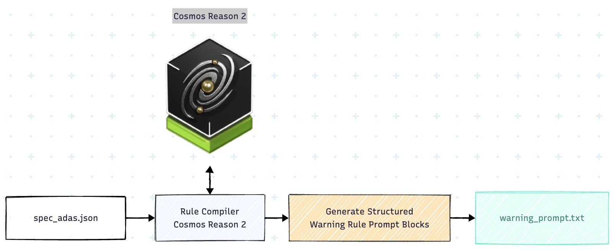
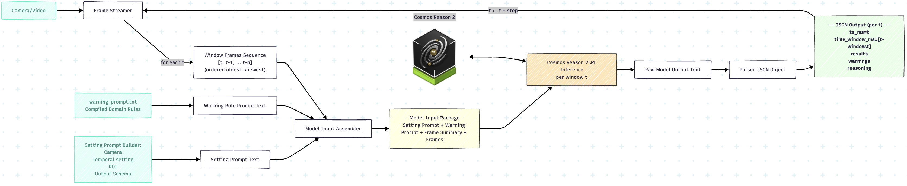

# vlm-adas-warning-system
A Cosmos Reason–powered ADAS warning system that compiles domain rules offline and performs strict-schema,  temporal inference on forward-facing video to output warnings with per-type explanations.

## Vision-Based Central Decision Brain for ADAS Warnings (Cosmos Reason Powered)

In conventional ADAS architectures, warning functions such as FCW, LDW, and others are typically implemented as **independent subsystems**:

- Lane detection pipeline → LDW
- Object detection + TTC estimation → FCW
- Traffic sign recognition → Speed warning
- Rule-based logic → alert gating

Each subsystem has its own perception stack, thresholds, and decision logic. This often leads to:

- Fragmented decision-making
- Inconsistent alert policies across functions
- High integration and maintenance complexity
- Heavy reliance on handcrafted heuristics

---

## A Different Approach: A Unified Reasoning Engine

`vlm-adas-warning-system` rethinks the architecture.

Instead of multiple independent warning subsystems, it acts as a:

> **Centralized reasoning brain** that performs multiple ADAS warning decisions purely from visual sequential input.

It focuses on replacing the **final decision logic layer** with a unified, structured VLM reasoning layer.

At runtime, the engine:

- Consumes forward-facing image sequences
- Applies structured domain rules
- Performs temporal reasoning
- Outputs multiple warning decisions under a unified schema

This shifts the system from:

- **Multiple independent alert logics**
to:
- **One centralized vision-based reasoning engine**

---

## Why the Rule Compiler Matters

A key challenge of using VLMs for safety-related tasks is:

> **Prompt ambiguity and inconsistency.**

If each engineer manually writes prompts for warning types (FCW, LDW, …), definitions inevitably differ:

- What “imminent” means
- What counts as “lane drift”
- Temporal persistence requirements
- Exclusion and suppression logic
- Coordinate conventions (LEFT/RIGHT interpretation)

This creates:

- Non-reproducible behavior
- Over-dependence on prompt engineers
- Inconsistent alert behavior across tasks
- Difficulty scaling to more warning categories

### The Role of the Rule Compiler

To solve this, `vlm-adas-warning-system` introduces a dedicated module:

**Rule Compiler**

Instead of writing prompts directly, we define a **standardized warning specification**:

- Warning types
- Core visual cues
- Temporal constraints
- Exclusion conditions
- Tie-breaker policies
- Design philosophy

The Rule Compiler then:

1. Takes the structured spec (`spec_adas.json`) as input
2. Uses **Cosmos Reason** offline
3. Generates structured, operational warning prompt blocks (`warning_prompt.txt`)
4. Ensures marker-wrapped, standardized rule format for each warning type

This achieves:

- Prompt standardization and consistency
- Reproducible warning logic
- Reduced human prompt bias
- Scalable extension to new warning types

The warning prompt is no longer handcrafted; it is **compiled from a formal specification**.

---

## End-to-End Pipeline

### 1) Define Warning Specification

A standardized task definition:

- `spec_adas.json`

### 2) Compile Warning Prompt (Offline)

Cosmos Reason converts specification → structured decision rules per warning type.

### 3) Runtime Inference (Online / Batch)

At inference time, three inputs are combined:

1. **Setting Prompt**
   - Camera constraints
   - Past-only temporal window
   - Output schema rules (strict JSON)
   - Coordinate conventions

2. **Compiled Warning Prompt**
   - Task-specific operational warning rules
   - Generated by Rule Compiler

3. **Sequential Frames**
   - Image sequence window

Comos reason inference -> Output: structured ADAS warnings

### 4) Structured Output

The engine outputs:

- Per-type triggered status (`results[TYPE].triggered`)
- Direction (`LEFT|RIGHT|CENTER|UNKNOWN` in **vehicle coordinate frame**)
- Evidence-based reasoning (triggered only)
- Safety justification (non-triggered only, mutually exclusive)

All under strict schema validation and normalization.

---
